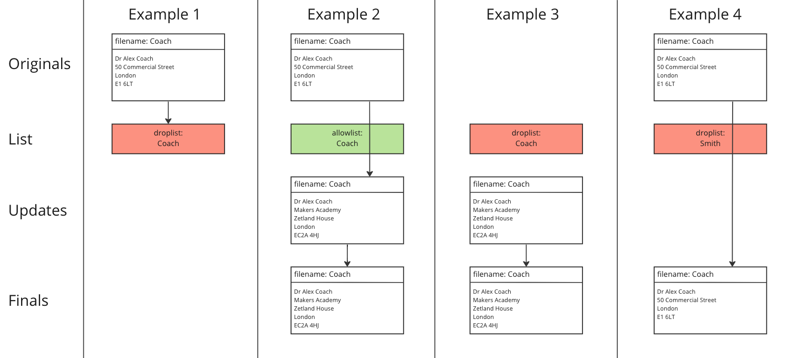

# Challenge

This challenge brings together a number of approaches and tools from the phases
you've recently covered in this module, but only in one case explicitly lists
which one you should be using (Faker) - use the knowledge you've gained to
determine what might be a good approach or approaches to help you understand,
then tackle the challenge.

<!-- OMITTED -->

The program description below isn't trivial, but you're likely to encounter
descriptions of functionality as a tester which you will need to understand.

## Description

A program has been designed to work on two sets of documents, according to some
rules and inputs.

* A directory <code style="color:#0088FF">updates</code> contains versions of
  document content that must be used as the final version
* A directory <code style="color:#0088FF">originals</code> can contain versions
  of document content that may or may not be kept and considered for use as the
  final version
* A single file lists documents that, were they to be present in <code
  style="color:#0088FF">originals</code>, are either:
  * Ignored from the <code style="color:#0088FF">originals</code> directory and
    hence not kept at all - the file defining this behaviour is called <code
    style="color:#FF4400">droplist</code>
  * Kept from the <code style="color:#0088FF">originals</code> directory and
    hence may be used, if not superseded by a document in <code
    style="color:#0088FF">updates</code> - the file defining this behaviour is
    called <code style="color:#44CC00">allowlist</code>

The program should add documents to a new directory called `finals` so that it
only contains documents kept or not dropped from <code
style="color:#0088FF">originals</code> (depending on the <code
style="color:#44CC00">allowlist</code>/<code
style="color:#FF4400">droplist</code> file presence and content) which were not
superseded by documents from <code style="color:#0088FF">updates</code>, along
with all the files from <code style="color:#0088FF">updates</code>.

The program expects either <code style="color:#FF4400">droplist</code> or <code
style="color:#44CC00">allowlist</code> to be present when it is run. <code
style="color:#0088FF">originals</code> and <code
style="color:#0088FF">updates</code> directories may or may not be empty.

## Your Task

The program is a first version and has been provided to you for some early
testing. It has been designed to work with **UK style addresses and names of
people**, where the surnames are used as the filenames.

You have been tasked with doing this and providing some **feedback to the
developer** on the program's current functionality, describing any bugs you find
and giving clear and concise steps for reproduction.

## Examples

Example scenarios to help clarify the functionality:

* **Example 1**: A document with a particular name exists in <code
  style="color:#0088FF">originals</code>, and a <code
  style="color:#FF4400">droplist</code> file exists which lists that document
  name. That version of the document must not ultimately be included in
  `finals`.
* **Example 2**: A document with a particular name exists in <code
  style="color:#0088FF">originals</code>, and an <code
  style="color:#44CC00">allowlist</code> file exists which lists that document
  name. That version of the document would have ultimately been included in
  `finals`, but a document of the same name also exists in <code
  style="color:#0088FF">updates</code>, and it's that version of the document
  that must ultimately be included in `finals`.
* **Example 3**: A document with a particular name does not exist in <code
  style="color:#0088FF">originals</code>. A <code
  style="color:#FF4400">droplist</code> file exists which lists that document
  name, but has no effect. A document of the same name exists in <code
  style="color:#0088FF">updates</code>, and it's that version of the document
  that must ultimately be included in `finals`.
* **Example 4**: A document with a particular name exists in <code
  style="color:#0088FF">originals</code>, and a <code
  style="color:#FF4400">droplist</code> file exists which doesn't list that
  document name. As there is no document of the same name in <code
  style="color:#0088FF">updates</code>, the version of the document from <code
  style="color:#0088FF">originals</code> must ultimately be included in
  `finals`.



> You may find it helpful to start by thinking through other possible examples.

## Errors

Certain errors have also been specified for particular scenarios - while the
content of the error message has been left to the developer to write, the
scenarios with errors are:

* Program run without specifying a directory on which to operate
* <code style="color:#0088FF">originals</code> folder not found
* <code style="color:#0088FF">updates</code> folder not found
* Missing both <code style="color:#FF4400">droplist</code> and <code
  style="color:#44CC00">allowlist</code>
* Both <code style="color:#FF4400">droplist</code> and <code
  style="color:#44CC00">allowlist</code> are present
* Document(s) don't contain correctly formatted addresses

As such, any errors caused by these scenarios are *as expected*. Makers can
assure you that you do not need to test for these errors (the bugs aren't with
the error messages!), although you are still welcome to test them if you wish.

## Resources

The program has been written and is available [here](./03_resources/). The
program expects to take a single argument of a target directory, which is
expected to contain <code style="color:#0088FF">originals</code> and <code
style="color:#0088FF">updates</code> directories and an <code
style="color:#44CC00">allowlist</code> or <code
style="color:#FF4400">droplist</code> file.

An example directory called `target_directory` has also been provided, which you
can use to get the program running successfully at least once. It matches
"Example 2", above.

You can run it as below, then inspect the contents of a `finals` directory,
created alongside the others:

```python
% python3 document_updater.py target_directory
% 
```

## Challenge Steps

This is a process feedback challenge. For this challenge, you won't necessarily
be submitting a video but you'll definitely be providing a link to GitHub where
you've put resources you've created - this could be anything from test planning
documentation, to test cases and feedback.

Your coaches would like to see you submit:
* Details of your test planning, especially any techniques from the course that
  you thought could be valuable to use here.
* At least two bug reports on bugs you've identified; carefully consider what
  those bugs need to contain from the perspective of developers *and*
  stakeholders.

You could optionally provide the following as well, if you wanted to:
* A short video recorded after the testing has completed, talking through what
  you did, what you found, problems, etc.

You do not need to provide:
* Any video recording of you planning the testing, writing scripts, nor running
  the tests.

Steps for this challenge:

1. Spend some time reviewing the description and scenarios above in order to
   gain some understanding about what the program is expected to do. Afterwards,
   try hand-crafting a scenario or two of your own and run the program to
   *explore* it, particularly if you're not sure of some of the behaviour,
   taking caution - maybe there are bugs...
2. Next, spend at least 30 minutes using appropriate techniques from these first
   two phases to better understand your task and the program, to plan scenarios
   the program may encounter and hence plan what tests you will run.
3. Create a script (or scripts) that makes use of Python Faker in order to
   create data you will use for your testing, set to use the "en_UK" locale. You
   should be using Faker-generated surnames as filenames (also in <code
   style="color:#FF4400">droplist</code>/<code
   style="color:#44CC00">allowlist</code> content) and Faker-generated addresses
   as the content of the documents in <code
   style="color:#0088FF">originals</code> and <code
   style="color:#0088FF">updates</code>.
4. Run your testing session however you think is appropriate, for no more than 2
   hours. Feel free to automate as much of the running of tests and checking as
   you wish. Don't feel limited to *only* use test data generated before you
   began running tests - make new data as you go, as you feel is necessary i.e.
   in order to produce the minimal steps required for reproduction.
5. After your testing, make sure you create feedback that would be appropriate
   for the intended audience i.e. bug reports, summary of testing.

> Note: while the challenge talks about a "first version" of the program and
> hints that it may contain bugs, we can assure you that there are a number of
> bugs in it! You'll need to use different testing approaches in order to
> uncover the bugs. You're not necessarily expected to find *all* of them, but
> speak with your coach(es) if you've been testing for a while and are not
> finding anything of interest.

### Submission

[After you're done, submit your video (if you made one) and a link to your
GitHub repository](https://airtable.com/shrNFgNkPWr3d63Db?prefill_Item=et_as02).

<!-- BEGIN GENERATED SECTION DO NOT EDIT -->

---

**How was this resource?**  
[😫](https://airtable.com/shrUJ3t7KLMqVRFKR?prefill_Repository=makersacademy%2Fextending-testing&prefill_File=phase2%2F03_challenge.md&prefill_Sentiment=😫) [😕](https://airtable.com/shrUJ3t7KLMqVRFKR?prefill_Repository=makersacademy%2Fextending-testing&prefill_File=phase2%2F03_challenge.md&prefill_Sentiment=😕) [😐](https://airtable.com/shrUJ3t7KLMqVRFKR?prefill_Repository=makersacademy%2Fextending-testing&prefill_File=phase2%2F03_challenge.md&prefill_Sentiment=😐) [🙂](https://airtable.com/shrUJ3t7KLMqVRFKR?prefill_Repository=makersacademy%2Fextending-testing&prefill_File=phase2%2F03_challenge.md&prefill_Sentiment=🙂) [😀](https://airtable.com/shrUJ3t7KLMqVRFKR?prefill_Repository=makersacademy%2Fextending-testing&prefill_File=phase2%2F03_challenge.md&prefill_Sentiment=😀)  
Click an emoji to tell us.

<!-- END GENERATED SECTION DO NOT EDIT -->
