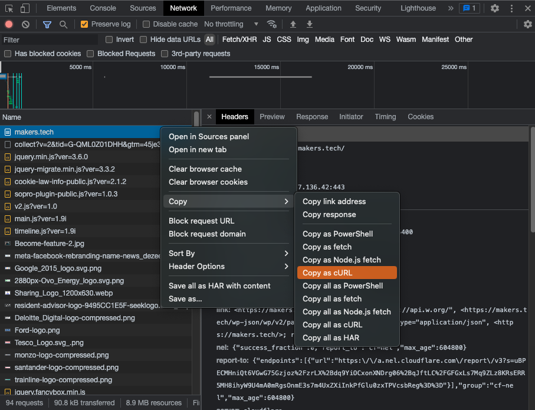

# Using cURL

We're going to introduce some tools you can use to test APIs: cURL and Postman.
People who use and/or test APIs tend to have their own preferred tool(s) and
things they like or dislike about them. When working with cURL, these are some
of the pros and cons:

* It's generally available anywhere you're working
* and very quick to get up and running to do something
* and going to make some assumptions for you...
* ...but those assumptions may not be right for what you want to do
* and it can become cumbersome when you want to add lots of headers or repeat
  other requests
* and it's hard to use data from one response to affect what's in the next
  request that you make

## Getting started with cURL

cURL is a very old, yet still very useful, tool which allows you to make command
line HTTP requests (among many other things). Handily, cURL is often
preinstalled and so you should just be able to run it straight away e.g. check
the install version:

```
% curl --version
curl 7.85.0 (x86_64-apple-darwin22.0) libcurl/7.85.0 (SecureTransport) LibreSSL/3.3.6 zlib/1.2.11 nghttp2/1.47.0
Release-Date: 2022-08-31
[...]
```

> Note: you'll probably have used cURL before, but might not remember it as it's
> been a few weeks since you [set up your
> machine](https://github.com/makersacademy/basic-programming/blob/main/setup/getting_started_mac.md)!

Given that cURL can make HTTP requests, cURL is therefore another type of
_client_ and we can use it to make requests of websites in the same sort of way
as we can with a browser.

In the previous section, we made a request to a URL of a site called ReqRes and
got back some JSON data by using a browser. So, let's now do the same but with
our latest HTTP client:

```
% curl "https://reqres.in/api/users/1"
```

Compare what you saw in your browser with what cURL is showing you. It should
(mostly) look the same, showing that the information from ReqRes' API is
requestable by clients of different types.

## Gaining visibility

The cURL command above was as simple as it gets - all we specified was a URL. In
reality, there's a lot more going on behind the scenes including some default
parameters and assumptions.

We know that an HTTP request was made and that we got some sort of response, but
things like the status code weren't visible, we didn't see any HTTP headers
(request or response) _and_ we didn't even specify a method! It looks like cURL
guessed we wanted to GET the URL. We can see more of what cURL is doing as
follows:

```
% curl --verbose "https://reqres.in/api/users/1"
```

Try this out for yourself first, take a look at the masses of information, then
come back here for some pointers!

Let's try to pick out some of the key lines in the very verbose output cURL is
now giving us - the section below doesn't contain everything, just the bits
we'll look at in more detail:

```
% curl --verbose "https://reqres.in/api/users/1"
> GET /api/users/1 HTTP/2
> Host: reqres.in
> user-agent: curl/7.85.0
> accept: *<!-- OMITTED -->*
```

is saying to the server receiving the request, that we'll "accept" any
formatting of response it wants to send back.

The response details show us the HTTP version again, shortly followed by "200" -
that's our response status code, previously hidden to us. We then have some
response headers, including one that's directly as a result of our Accept
request header:

```
< content-type: application/json; charset=utf-8
```

Because we said we'd accept any formatting of the response, the server has sent
back JSON _and_ has told us that the content is JSON.

<details>
  <summary>Why do you think it's important for the server to tell the client the "Content-Type"
  i.e. what format the response body data is in?</summary>

We originally made a request with an Accept header that said we'd accept any
response format. Now, we could assume that it's going to be JSON because that's
what we saw in the browser and that's what we've always got back, but if we were
writing some automated client that was making those requests, it would be a lot
safer to try to parse the response body as JSON _after_ we'd checked whether
that's what we'd been sent! If the server suddenly switched to a YAML response
and we didn't check, we might find a fair few errors creep into our code when
parsing the response...
</details>

## cURL Methods, Headers, etc.

> Note: ReqRes acts in a way that looks like modifications are being made to the
> data, but actually no changes are occurring. Later on, when we try deleting a
> user, remember that we're seeing a response that _looks_ like it was deleted
> successfully, but in reality that user still exists on ReqRes for all the
> other clients out there using the site.

We've seen how to get more information about what cURL is requesting and seeing
in the response, so now let's take control of those things ourselves. We're
going to add our own request header and we're going to choose a different
request method.

We can GET a single user, as follows:

```
% curl "https://reqres.in/api/users/2"
"data":{"id":2,"email":"janet.weaver@reqres.in","first_name":"Janet","last_name":"Weaver","avatar":"https://reqres.in/img/faces/2-image.jpg"},"support":{"url":"https://reqres.in/#support-heading","text":"To keep ReqRes free, contributions towards server costs are appreciated!"}}
```

but let's change this to DELETE the user instead, plus we'll add in a header of
our own, and we'll turn on the verbosity, by doing this:

```
% curl --verbose -X DELETE -H "X-My-Header: Hello there" "https://reqres.in/api/users/2"
```

We can use the `-X` flag to specify our own method and `-H` to define a new
header. (N.B. if you wanted >1 header, add >1 `-H` flags and values to the
command.)

From the above command, you should get something that looks like this:

```
> DELETE /api/users/2 HTTP/2
> Host: reqres.in
> user-agent: curl/7.85.0
> accept: */*
> x-my-header: Hello there
< HTTP/2 204
```

and no response body. It's common when deleting a resource that there's no
response body sent back, and it's the status code - 204 in this case - that's
proof of success. You can also see that our extra header is included in the
request that's made.

If you're interested in what else cURL can do, just type the following in to see
cURL's "manual":

```
% man curl
```

## Dev Tools

cURL also shows up in Chromium Dev Tools. If you browse to a site with Dev Tools
open on the Network tab, you will see one or more requests. Select the first one
and then, from that request's context menu you can select `Copy => Copy as cURL`
to get the same request as recorded in the Network tab, all ready to run as a
cURL command.



If you ever want to re-run a request, perhaps with slight modifications, this
route using cURL can be a quick way to do so.

It's also possible to import cURL requests into Postman, another HTTP client,
and that's where we'll head next.

[Next Challenge](03_postman_introducing_the_interface.md)

<!-- BEGIN GENERATED SECTION DO NOT EDIT -->

---

**How was this resource?**  
[😫](https://airtable.com/shrUJ3t7KLMqVRFKR?prefill_Repository=makersacademy%2Fextending-testing&prefill_File=phase5%2F02_using_curl.md&prefill_Sentiment=😫) [😕](https://airtable.com/shrUJ3t7KLMqVRFKR?prefill_Repository=makersacademy%2Fextending-testing&prefill_File=phase5%2F02_using_curl.md&prefill_Sentiment=😕) [😐](https://airtable.com/shrUJ3t7KLMqVRFKR?prefill_Repository=makersacademy%2Fextending-testing&prefill_File=phase5%2F02_using_curl.md&prefill_Sentiment=😐) [🙂](https://airtable.com/shrUJ3t7KLMqVRFKR?prefill_Repository=makersacademy%2Fextending-testing&prefill_File=phase5%2F02_using_curl.md&prefill_Sentiment=🙂) [😀](https://airtable.com/shrUJ3t7KLMqVRFKR?prefill_Repository=makersacademy%2Fextending-testing&prefill_File=phase5%2F02_using_curl.md&prefill_Sentiment=😀)  
Click an emoji to tell us.

<!-- END GENERATED SECTION DO NOT EDIT -->
