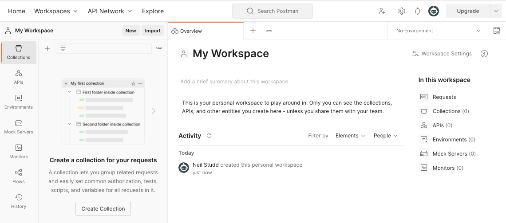
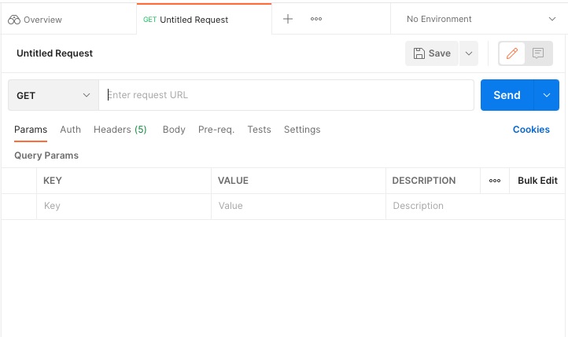

# Exploratory API testing with Postman

There are many tools on the market (often free and/or open-source) which are 
designed to assist with testing APIs, but Postman is by far the most popular, 
with the richest set of features. However, this abundance of features can also 
be overwhelming to new users, so we're going to take a walkthrough of how to 
use its most common functions. 

By the time we're done, you'll know how to execute requests to support your 
exploratory testing of API endpoints - and you'll even know a few tricks about 
how to automate your checking of responses.

## Getting started

Postman began its life as an extension in the Chrome Web Store, when creator 
Abhinav Asthana found himself unsatisfied with the lack of dedicated tooling to 
support API testing. Since then, Postman has grown into a multi-billion dollar 
organisation, with over 20 million users worldwide, and the application has 
grown to service the entire API application development lifecycle, including 
stages such as design, documentation, collaboration and governance.

During this time, Postman outgrew its origins as a simple Chrome extension, and 
it's now accessible via two different methods:

* A [downloadable app](https://www.postman.com/downloads/) which runs natively 
on your machine.
* A [browser-based version](https://www.postman.com/) (simply follow the free 
"Sign Up" link, or the "Sign In" link if you already have an account).

There are some very subtle differences between the two versions - especially if 
you find yourself wanting to test local applications, or applications which are 
only available on an internal network - but for the purposes of getting familiar
with Postman, pick whichever you're most comfortable with (depending on whether 
you're a "browser person" or an "app person").

  
:speech_balloon: So, Postman is free?

  
  ---

  Postman's core features, for making API requests and analysing their 
  responses, are free. There are some more advanced features (especially 
  around managing large teams, and running at scale) which are either restricted
  or locked unless you're [on a paid plan](https://www.postman.com/pricing/), 
  but you're unlikely to encounter many restrictions in your day-to-day Postman 
  usage.

  ---

## Navigating the user interface

Whichever version of Postman you choose to use, your initial view after login 
will look something like this:

You'll be in a default **workspace**, named `My Workspace` by default. There 
are buttons/links which reference other types of resources too. The 
most notable right now is **collections**, which is a term for one or more 
folders/subfolders containing sample **requests** - we'll look more at these in 
a moment.

For now, it's worth knowing that you can also create ad-hoc / temporary 
requests which don't need to reside within a collection. The quickest way to 
do this is to click the `+` icon next to the Overview tab at the top of the 
page. (Alternatively, you can click the `New` button, and select "HTTP 
Request" from the list of building blocks - but try not to be distracted by all 
of the other types of resource which are on offer!)

When you begin to create a new request, the following tab will appear:

There's a lot going on here, so let's go through some of the most commonly-used
features:

* The dropdown which shows `GET` by default allows you to select which HTTP 
method you wish to use for your request. You'll recall from your work in the Web 
module that `GET` and `POST` are especially common, however if you expand this 
dropdown you'll see that there are many other verbs available!
* The form field which contains the placeholder `Enter request URL` is, like a 
web browser, where you enter the URL that you want to access. As we'll see 
shortly, it's possible to make this value dynamic (for example, so that you 
can easily switch between querying your test and production servers) but for 
now, just know that you can happily hard-code any URL that you wish.
* The `Send` button will submit the request to the specified URL, with the 
HTTP method that you specified.
* The tabs beneath this (Params, Auth, Headers, Body, etc) allow you to control 
other aspects of the request data, such as including any authorisation, request
headers or other data. We'll look at these in more detail shortly.

## Summary

Now that you're running Postman, and hopefully slightly less intimidated by all 
of those buttons, it's time to start running some requests, and taking a look 
at how Postman visualises its responses.

[Next Challenge](04_postman_making_a_get_request.md)

<!-- BEGIN GENERATED SECTION DO NOT EDIT -->

---

**How was this resource?**  
[😫](https://airtable.com/shrUJ3t7KLMqVRFKR?prefill_Repository=makersacademy%2Fextending-testing&prefill_File=phase5%2F03_postman_introducing_the_interface.md&prefill_Sentiment=😫) [😕](https://airtable.com/shrUJ3t7KLMqVRFKR?prefill_Repository=makersacademy%2Fextending-testing&prefill_File=phase5%2F03_postman_introducing_the_interface.md&prefill_Sentiment=😕) [😐](https://airtable.com/shrUJ3t7KLMqVRFKR?prefill_Repository=makersacademy%2Fextending-testing&prefill_File=phase5%2F03_postman_introducing_the_interface.md&prefill_Sentiment=😐) [🙂](https://airtable.com/shrUJ3t7KLMqVRFKR?prefill_Repository=makersacademy%2Fextending-testing&prefill_File=phase5%2F03_postman_introducing_the_interface.md&prefill_Sentiment=🙂) [😀](https://airtable.com/shrUJ3t7KLMqVRFKR?prefill_Repository=makersacademy%2Fextending-testing&prefill_File=phase5%2F03_postman_introducing_the_interface.md&prefill_Sentiment=😀)  
Click an emoji to tell us.

<!-- END GENERATED SECTION DO NOT EDIT -->
