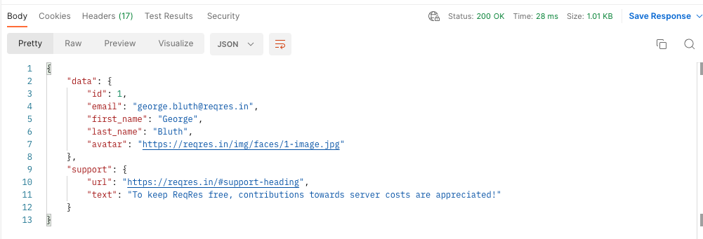
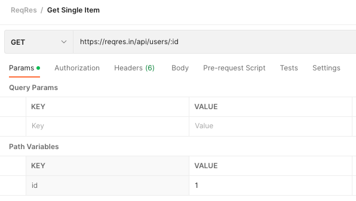

# Postman: Making a GET request

Let's try making some requests to ReqRes from within Postman, to compare with 
our cURL command-line experience. We'll retrieve the first user from their data, 
and look at the response data within the Postman interface.

With the `GET` verb selected, enter `https://reqres.in/api/users/1` in the 
request URL, and click the `Send` button. If your request is successful, you'll 
see that Postman displays a new **Response** panel beneath the request:

  
:speech_balloon: What's the significance of the `1` in the 
  URL?

  
  ---

  This is an example of a URL which contains a variable within the path itself -
  it may not surprise you to learn that we call these **path variables**.

  If you want to see this more clearly, Postman allows you to specify variable 
  names within the URL itself, which then allows you to modify their value on 
  the Params tab (just like a normal query parameter).

  Modify the request URL to `https://reqres.in/api/users/:id` (the colon is 
  important - this indicates that you are specifying the name of a path 
  variable). Now, when you look at the Params tab, you will see that `id` is 
  appearing in the list of parameters, allowing you to specify the value (such 
  as 1) within Postman's parameters grid.

  

  ---

While the response body itself looks deceptively simple, there are a lot of 
things going on here which will aid you in your quest for API domination:

* Postman identifies the format of the response, and renders it in a "pretty" 
format where possible. Like many APIs, ReqRes returns its data in JSON format, 
so Postman has utilised JSON formatting to make the data easier for you to 
evaluate. (Among the other body tabs available, the `Raw` tab will show you the 
exact data which was returned, just like cURL did.)
* The first row of the response panel contains some useful metadata, such as 
the response code, the time that the server took to process the request, and 
the size of the response.
* The tabs at the top of the panel allow you to view any cookies or headers 
which were returned by the request.
* You'll also notice that it has the ability to display Test Results. Patience, 
we'll look at these in the next chapter, but it's reassuring to know that this 
is where you'll be able to see your results!

Hopefully the exploratory tester inside you is already seeing how you could use 
Postman to test a variety of different scenarios. For example, if you request 
`/users/2`, do you retrieve the user with ID #2? What happens if you enter a 
non-numeric ID? What happens if you specify a large ID which doesn't exist in 
the database? Does this behaviour seem acceptable?

## Summary

That's how you send a `GET` request in Postman, but `POST` requests tend to be 
a bit more complicated, as it often involves sending more complicated and more 
varied data. We'll move on to look at this next.

[Next Challenge](05_postman_making_a_post_request.md)

<!-- BEGIN GENERATED SECTION DO NOT EDIT -->

---

**How was this resource?**  
[😫](https://airtable.com/shrUJ3t7KLMqVRFKR?prefill_Repository=makersacademy%2Fextending-testing&prefill_File=phase5%2F04_postman_making_a_get_request.md&prefill_Sentiment=😫) [😕](https://airtable.com/shrUJ3t7KLMqVRFKR?prefill_Repository=makersacademy%2Fextending-testing&prefill_File=phase5%2F04_postman_making_a_get_request.md&prefill_Sentiment=😕) [😐](https://airtable.com/shrUJ3t7KLMqVRFKR?prefill_Repository=makersacademy%2Fextending-testing&prefill_File=phase5%2F04_postman_making_a_get_request.md&prefill_Sentiment=😐) [🙂](https://airtable.com/shrUJ3t7KLMqVRFKR?prefill_Repository=makersacademy%2Fextending-testing&prefill_File=phase5%2F04_postman_making_a_get_request.md&prefill_Sentiment=🙂) [😀](https://airtable.com/shrUJ3t7KLMqVRFKR?prefill_Repository=makersacademy%2Fextending-testing&prefill_File=phase5%2F04_postman_making_a_get_request.md&prefill_Sentiment=😀)  
Click an emoji to tell us.

<!-- END GENERATED SECTION DO NOT EDIT -->
