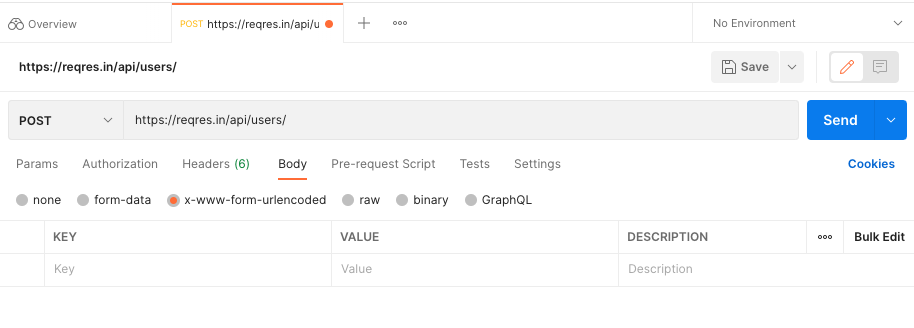
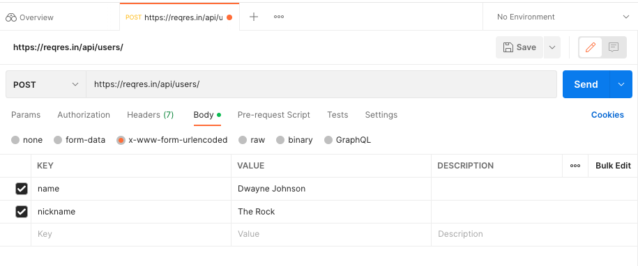
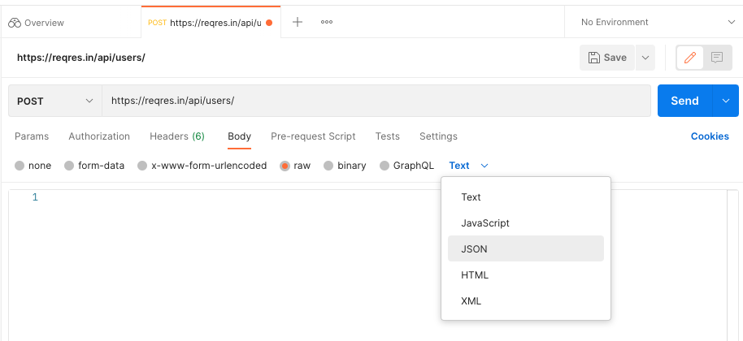

# Postman: Making a POST request

Whereas a `GET` request will typically just consist of a URL, potentially with 
some dynamic data (such as the relevant resource ID) within the URL's query 
parameters, a `POST` request also contains **request body** within the data 
that we send (we sometimes refer to this as a **payload**).

Let's try a simple example of constructing (and sending) body data within a 
Postman request. Open a new request tab, select the `POST` method from the 
dropdown, and put `https://reqres.in/api/users/` into the request URL. Switch 
over to the `Body` tab, and you should see the following view:



You'll notice a series of horizontal radio buttons which specify the **content 
type** of your request. The correct content type will be dependent on the 
server that you're communicating with; you could discover this by 
experimentation, or by speaking with the developers.

In the case of ReqRes, we can either use the `x-www-form-urlencoded` or `raw` 
types - we'll look at both of them. Firstly, with the `x-www-form-urlencoded` 
type selected, we'll create a user for everybody's favourite wrestler turned 
actor:



Click `Send` on the request, and the response body should show you that ReqRes
has received and processed this data (the ID is generated randomly):

```json
{
    "name": "Dwayne Johnson",
    "nickname": "The Rock",
    "id": "558",
    "createdAt": "2023-01-30T11:26:33.877Z"
}
```

In the request body parameters, notice that there are also checkboxes which 
allow you to activate or deactivate parameters. What do you think will happen 
if you uncheck "nickname", and send the request again? (Check to see if you 
are correct!)

Often our request data is more complex than simple key-value pairs, so you're 
likely to spend much more of your time on the `raw` tab. When you select this 
tab, you'll notice that another dropdown appears at the end, allowing you to 
explicitly set the type of data that you're working with:



As per the screenshot, we want to select the `JSON` option, as this is what 
ReqRes is expecting to receive. Once you've done this, copy and paste the below 
JSON into the large text box beneath the radio buttons:

```json
{
    "name": "Steve Austin",
    "nickname": "Stone Cold",
    "age": 58,
    "films": [
        "The Condemned",
        "The Expendables",
        "The Longest Yard"
    ]
}
```

Note that, although the raw view may seem a little intimidating to work with (as 
you'll need to manually craft your data), it gives you additional power which 
you didn't have in your previous request:

* Because you're dealing with raw JSON, you can explicitly specify your data 
types. We're sending `age` as an integer (note it doesn't have any quote marks 
around it). If we'd entered `58` in the `x-www-form-urlencoded` tab, the value 
would have been converted to the string `"58"`, which our server might not be 
able to process.
* Similarly, we can also deal with more complex data types, such as the provided 
array of films. You'll remember from your previous exposure to JSON that this 
data can potentially get much more complicated too.

Send this request, and confirm that your submitted values are mirrored back in 
Postman's response body.

## Summary

We've seen how you can make `GET` and `POST` requests as a one-off in Postman, 
by creating new application tabs and sending the desired data. But what if you 
want this data to persist, or share it with colleagues? Next, we're going to 
look at how to store Postman data within collections.

[Next Challenge](06_postman_collections_and_folders.md)

<!-- BEGIN GENERATED SECTION DO NOT EDIT -->

---

**How was this resource?**  
[😫](https://airtable.com/shrUJ3t7KLMqVRFKR?prefill_Repository=makersacademy%2Fextending-testing&prefill_File=phase5%2F05_postman_making_a_post_request.md&prefill_Sentiment=😫) [😕](https://airtable.com/shrUJ3t7KLMqVRFKR?prefill_Repository=makersacademy%2Fextending-testing&prefill_File=phase5%2F05_postman_making_a_post_request.md&prefill_Sentiment=😕) [😐](https://airtable.com/shrUJ3t7KLMqVRFKR?prefill_Repository=makersacademy%2Fextending-testing&prefill_File=phase5%2F05_postman_making_a_post_request.md&prefill_Sentiment=😐) [🙂](https://airtable.com/shrUJ3t7KLMqVRFKR?prefill_Repository=makersacademy%2Fextending-testing&prefill_File=phase5%2F05_postman_making_a_post_request.md&prefill_Sentiment=🙂) [😀](https://airtable.com/shrUJ3t7KLMqVRFKR?prefill_Repository=makersacademy%2Fextending-testing&prefill_File=phase5%2F05_postman_making_a_post_request.md&prefill_Sentiment=😀)  
Click an emoji to tell us.

<!-- END GENERATED SECTION DO NOT EDIT -->
