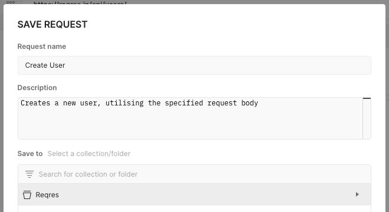
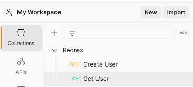
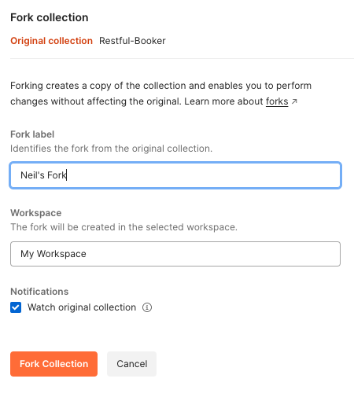
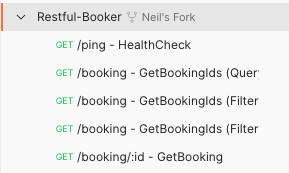

# Postman: Creating collections and folders

So far, you've been working in standalone tabs in the Postman interfaces. Just 
like a web browser, when you close a tab, it's gone forever. (Actually, you can 
technically recover it via the `History` tab on the left-hand side.)

When we're working with real-world APIs, we typically want something more 
permanent, so that we can make requests to different endpoints without having 
to hand-carve the URLs every time. This is where **Collections** become useful.

A collection is just a fancy name for a top-level folder containing all of the 
requests for a particular domain. You might have a single collection for your 
entire application, or a different collection for each of your microservices. 
Just like storing folders on a disk or cloud drive, how you choose to structure 
your data is largely up to you.

Let's create a simple example for ourselves:

* With the Collections panel visible on the left, click `Create Collection`. 
(Alternatively, you can click the `New` button at the top, and then select 
"Collection" from the list of building blocks.)
* A tab will appear for your new collection, with the title "New Collection" 
pre-selected. Change the name to "ReqRes", so that we know which requests are 
going to reside in the collection.
* Find the tabs for your `GET` and `POST` requests, and click the `Save` button. 
Save them into your new ReqRes collection, making sure you give the request a 
name/description to help you to use them in the future:

Once you've done this, your Collection view will now allow you to quickly move 
back and forth between the different endpoints in your application. It's also 
possible to export a collection, so that another member of your team can import 
it into their own Postman instance; you can synchronise your data to a shared 
GitHub repository; or you can share a link allowing team-mates to collaborate 
on the same shared collection.

## Importing a collection

Before we finish this chapter, we're going to take a realistic API which 
contains multiple endpoints, some of which require you to be authenticated (and 
where you have the power to generate these authentication tokens for yourself). 
We're using an API called [Restful 
Booker](https://restful-booker.herokuapp.com/), which allows you to perform the 
full set of CRUD (Create, Read, Update, Delete) actions on a set of test data.

  
:speech_balloon: Wait, where did my data go?

  
  ---

  As you'll notice if you look at the Restful Booker website, it's a popular 
  site which is used by a lot of testers worldwide. It's incorporated into 
  training courses (like this one!), it's used in workshops, and it's heavily 
  utilised in the book "Testing Web APIs" by its creator Mark Winteringham. 
  It's also used for a variety of activities, including bug hunts, performance 
  testing and security testing.

  Because of this, the data within Restful Booker is reset to its default state 
  **every 10 minutes**. This means that you might occasionally encounter a 
  strange situation where (for instance) you create booking ID 123, but when 
  you attempt to retrieve booking ID 123, it doesn't exist any more. Don't 
  panic, it's nothing that you did! Just bear this in mind, as it might explain 
  any oddities that you observe.

  ---

We'll begin by importing a pre-made Postman collection, which is maintained by 
the application's creators. (This is another of Postman's strengths - it's 
effectively a huge API search engine.)

* If you're using the web version of Postman, click [this 
link](https://www.postman.com/automation-in-testing/workspace/restful-booker-collections/collection/92957-79993f00-4d3a-4766-abbf-efff6b15a853?action=share&creator=25846816) 
to go directly to the Restful Booker collection.
* If you're using the desktop version of Postman, simply type `Restful Booker 
Collections` into the search bar at the top of the application, and click the 
one which is owned by "Automation in Testing". (This is the original version - 
the other versions in the search results are clones of the original.)

Click on the collection called `Restful-Booker` (not the one called 
`Request-Booker-Platform`). You'll notice that, just like in GitHub, there's a 
`Fork` option; click this button, and create a fork of the collection in your 
own workspace:

Now you should find yourself back in your own workspace, with an editable 
version of the collection that you can work with yourself.

## Summary

By importing a collection, we've seen how we're able to quickly create 
visibility into the structure of an API. The imported collection will also 
allow us to demonstrate some other key facets of Postman: namely, dynamic 
variables and environments.

[Next Challenge](07_postman_variables_and_environments.md)

<!-- BEGIN GENERATED SECTION DO NOT EDIT -->

---

**How was this resource?**  
[😫](https://airtable.com/shrUJ3t7KLMqVRFKR?prefill_Repository=makersacademy%2Fextending-testing&prefill_File=phase5%2F06_postman_collections_and_folders.md&prefill_Sentiment=😫) [😕](https://airtable.com/shrUJ3t7KLMqVRFKR?prefill_Repository=makersacademy%2Fextending-testing&prefill_File=phase5%2F06_postman_collections_and_folders.md&prefill_Sentiment=😕) [😐](https://airtable.com/shrUJ3t7KLMqVRFKR?prefill_Repository=makersacademy%2Fextending-testing&prefill_File=phase5%2F06_postman_collections_and_folders.md&prefill_Sentiment=😐) [🙂](https://airtable.com/shrUJ3t7KLMqVRFKR?prefill_Repository=makersacademy%2Fextending-testing&prefill_File=phase5%2F06_postman_collections_and_folders.md&prefill_Sentiment=🙂) [😀](https://airtable.com/shrUJ3t7KLMqVRFKR?prefill_Repository=makersacademy%2Fextending-testing&prefill_File=phase5%2F06_postman_collections_and_folders.md&prefill_Sentiment=😀)  
Click an emoji to tell us.

<!-- END GENERATED SECTION DO NOT EDIT -->
