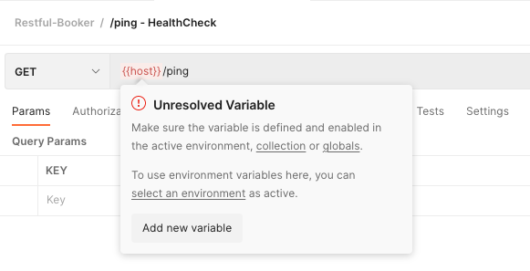
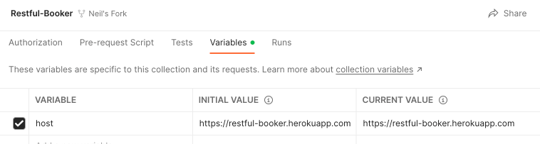

# Postman Variables and Environments

Let's try to use this new Restful Booker collection. We'll start with a simple 
test: let's see if we can access the application's `/ping` endpoint to perform 
a simple health check.

Open the `/ping` request within the collection. Before you click Send, can you 
see any clues as to why this might not work? What do you observe, and what do 
you think you can imply from it?

  
Stumped? The answers are here.

  
  ---

  You might have guessed from the section header, but the URL for this request 
  is utilising a **variable**, which is expressed in Postman by enclosing the 
  name of the variable within double-braces (`{{host}}` in this example).

  The variable is highlighted in red within Postman, because you haven't 
  defined this variable yet. If you hover over the variable, Postman will give 
  you some hints about how to fix it; we're going to manually choose how to 
  resolve the problem.

  

  ---

Just as when writing code, variables give us a lot of flexibility within 
Postman, allowing us to reduce duplication and allow easier maintenance. And 
just like in your code, Postman variables can have different **scope**: 

* You can have a global variable (e.g. you could have a `host` variable which 
persists across every collection that you ever work with).
* You can have a collection variable which only persists within that collection.
* You can have a folder variable which only persists within that folder.
* ...And these can override each other. So, for instance, if you have the same 
`host` for 99% of your requests, you could declare this as a global variable; 
if you create a variable called `host` in a single folder, then this will take 
precedence.

Postman also has a hugely powerful concept called **Environments** (you may 
have already spotted an Environment dropdown which is visible in the top-right 
of the application). This allows you to create different sets of variables to 
(for example) set different `host` values depending on whether you want to test 
your Test or Production server.

For Restful Booker, we'll solve this in the way which seems simplest for our 
current needs. Every request within the collection contains a `{{host}}` 
prefix in the URL, so we're going to create a collection-level variable for 
this.

1. Click on the Restful Booker collection name.
2. In the main panel, click on the Variables tab.
3. Create a new variable called `host`, and set its initial value to the API's 
URL prefix - `https://restful-booker.herokuapp.com` (make sure there isn't a 
trailing slash - all of the requests in the collection already have a slash in 
them).
4. **Click Save on the Variables tab** - if you don't do this, your changes 
won't take effect. Trust me, you'll forget this a lot.

If you return to the Health Check request tab, you should see that the 
`{{host}}` variable is now orange, not red; this is because Postman now knows 
that the variable exists (and if you hover over it, it will confirm the current 
value, and which scope the variable was found in).

## Summary

Now that you're able to wield Postman as a weapon, it's time to put your skills 
into practice. You'll move on to record yourself performing a realistic 
challenge using the Restful Booker collection.

[Next Challenge](08_postman_challenge.md)

<!-- BEGIN GENERATED SECTION DO NOT EDIT -->

---

**How was this resource?**  
[😫](https://airtable.com/shrUJ3t7KLMqVRFKR?prefill_Repository=makersacademy%2Fextending-testing&prefill_File=phase5%2F07_postman_variables_and_environments.md&prefill_Sentiment=😫) [😕](https://airtable.com/shrUJ3t7KLMqVRFKR?prefill_Repository=makersacademy%2Fextending-testing&prefill_File=phase5%2F07_postman_variables_and_environments.md&prefill_Sentiment=😕) [😐](https://airtable.com/shrUJ3t7KLMqVRFKR?prefill_Repository=makersacademy%2Fextending-testing&prefill_File=phase5%2F07_postman_variables_and_environments.md&prefill_Sentiment=😐) [🙂](https://airtable.com/shrUJ3t7KLMqVRFKR?prefill_Repository=makersacademy%2Fextending-testing&prefill_File=phase5%2F07_postman_variables_and_environments.md&prefill_Sentiment=🙂) [😀](https://airtable.com/shrUJ3t7KLMqVRFKR?prefill_Repository=makersacademy%2Fextending-testing&prefill_File=phase5%2F07_postman_variables_and_environments.md&prefill_Sentiment=😀)  
Click an emoji to tell us.

<!-- END GENERATED SECTION DO NOT EDIT -->
