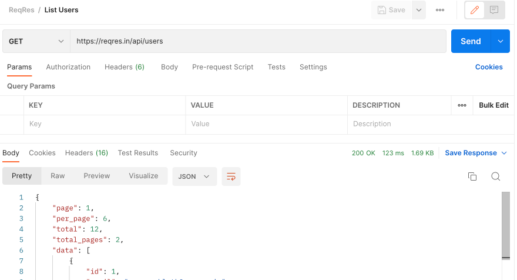
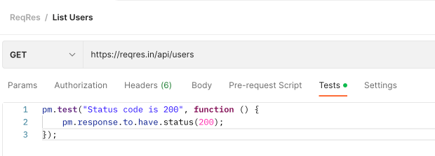
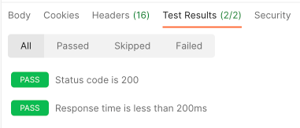
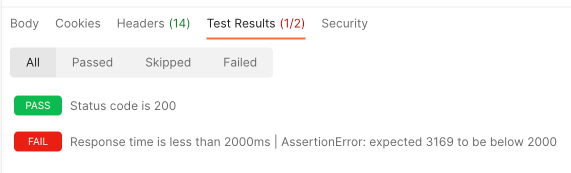

# Automated API checks with Postman

You've already seen much of the power of Postman, its ability to query API 
endpoints in a dynamic fashion, and how it displays its response data in a way 
that's easy to understand.

However, sometimes your response data will be large or complex, and perhaps you 
want to validate that it contains some specific expected values. Just as with 
other testing activities, this is something that you could check manually; but 
given that it's a binary check, wouldn't it be helpful if we could add this to 
our automation stack?

Thankfully, Postman makes this very easy, via the **Tests** tab which is 
available on every request. (You'll also find the Tests tab when you click on a collection or a folder, allowing you to write tests which are applied against 
every single request.)

Postman uses a Node.js based scripting engine for its testing, but if you don't 
have prior experience with JavaScript, never fear: there is excellent [Postman scripting documentation](https://learning.postman.com/docs/writing-scripts/) 
available, and Postman contains a variety of pre-built "snippets" which make it 
easy to get started.

## Writing your first test

Create a new `GET` request for `https://reqres.in/api/users`. Send the request in Postman, and observe the results that come back.



Notice at the top of the response panel, it displays the HTTP response code 
(`200 OK`) and how long the server took to complete the response (in the 
screenshot, it took 123 milliseconds). Let's quickly write a couple of checks 
to ensure that these values are still acceptable on future requests.

* Click on the `Tests` tab of the request.
* Look at the `Snippets` section on the right-hand side. You should see one 
which is labeled "Status code: Code is 200" (you may need to scroll the list, 
depending on your screen size).
* Click on the "Status code: Code is 200" link. You'll notice that a snippet of 
code is inserted into the main Tests panel:



You might recognise this as JavaScript, but the objects and methods that it's 
using will be new to you. The `pm` object is provided natively within Postman, 
and exposes access to Postman's internal data, as well as its testing and 
assertion engine. You can find more documentation about the `pm` object within 
[Postman's JavaScript 
documentation](https://learning.postman.com/docs/writing-scripts/script-references/postman-sandbox-api-reference/).

Next, find the snippet called "Response time is less than 200ms". Click this 
snippet to insert it into your tests, and review the inserted code to see if 
you can understand what it's doing.

Now, every time you click Send on your request, Postman will run your tests 
after the response is received. You'll notice that the `Test Results` section 
of the response panel now shows how many test you've run, and how many of them 
have passed.



Congratulations, you've gained some free test coverage for your API endpoints! 
Now, if the endpoint returns too slowly, or if it doesn't return a `200 OK` 
status, Postman will automatically flag this for you.

ReqRes allows us to demonstrate this, as it has a feature which allows us to 
simulate a slow response from an API. Change your request URL to 
`https://reqres.in/api/users?delay=3` (this instructs the API to wait for 3 
seconds before responding). Now when you press Send again, the API takes more 
than 2 seconds to respond, resulting in one of your tests failing:



## More complex examples

There are many more types of assertions which can be written in Postman; many of 
them can be discovered by exploring the documentation, or clicking on the 
different snippets to see what code they create. Let's look at a couple of 
examples which are specific to this endpoint.

Notice that the response contains an attribute `"total": 12`, indicating the 
total number of entries in the ReqRes data set. Given that this is a fixed set 
of test data, we should always expect the value `12` to be returned here.

Copy the following Postman test code, and paste it into the Tests panel beneath 
your current tests:

```javascript
pm.test("Response contains total 12 records", function () {
    var jsonData = pm.response.json();
    pm.expect(jsonData.total).to.eql(12);
});
```

This test loads the JSON response into an object variable called `jsonData`, 
and then you can simply use `jsonData.total` to access the `total` value from 
the response body. Run it - you should see that it passes. (As with all 
automation, you should also check that it's capable of failing - change it to 
expect 20 records, and the test will turn red.)

Finally for now, here's an example of iterating over array data within a 
response. The `data` node contains a list of different users (6 users per 
"page"); let's check some of the data integrity here.

Insert the following code beneath the existing tests in your Tests panel:

```javascript
pm.test("Every user has a numeric ID", function () {
    var jsonData = pm.response.json();
    jsonData.data.forEach(function(user) {
        pm.expect(user.id).to.be.a("number");
    });
});
```

There's a bit more JavaScript being used here, but can you understand what it's
doing by looking at the code? Look at the specific keywords and JSON attributes 
which are being referenced.

<details>
  <summary>Ready for the answer?</summary>
  
  ---

  Once again, we retrieve the response body, and store it as a JSON object in 
  the `jsonData` variable.

  Within the JSON, we access the `data` attribute (you can see this on line 6 
  of the response data) and use the `forEach` keyword to say "repeat this bit 
  of code for each individual item in the array".

  `function(user)` means "every time we're going through this loop, load the 
  current entry into a variable called `user`". That's why we can subsequently 
  refer to `user.id`; each time through the loop, we'll retrieve the `id` value 
  for the current user in the array.

  Finally, the assertion itself is quite straightforward as it's written using 
  the [Chai](https://www.chaijs.com/) library, which allows assertions to be 
  specified in human-readable format. 

  ---

</details>

Run this test, and it should pass, because each of the users in the response 
contains a numeric ID. Think about how you might be able to demonstrate this 
test failing. (For instance, what if your assertion refers to an attribute 
which isn't numeric? Or what if you change your ID assertion to expect a 
string?)

## Summary

You've glimpsed the power of the testing engine which is built into Postman, 
and how it can augment Postman's ability to support your exploratory API 
testing. But there's so much more that Postman can do: we're going to conclude 
our Postman investigations by highlighting a few other valuable features which 
can solve particular testing challenges.

[Next Challenge](10_advanced_postman_features.md)

<!-- BEGIN GENERATED SECTION DO NOT EDIT -->

---

**How was this resource?**  
[😫](https://airtable.com/shrUJ3t7KLMqVRFKR?prefill_Repository=makersacademy%2Fextending-testing&prefill_File=phase5%2F09_automated_api_checks_with_postman.md&prefill_Sentiment=😫) [😕](https://airtable.com/shrUJ3t7KLMqVRFKR?prefill_Repository=makersacademy%2Fextending-testing&prefill_File=phase5%2F09_automated_api_checks_with_postman.md&prefill_Sentiment=😕) [😐](https://airtable.com/shrUJ3t7KLMqVRFKR?prefill_Repository=makersacademy%2Fextending-testing&prefill_File=phase5%2F09_automated_api_checks_with_postman.md&prefill_Sentiment=😐) [🙂](https://airtable.com/shrUJ3t7KLMqVRFKR?prefill_Repository=makersacademy%2Fextending-testing&prefill_File=phase5%2F09_automated_api_checks_with_postman.md&prefill_Sentiment=🙂) [😀](https://airtable.com/shrUJ3t7KLMqVRFKR?prefill_Repository=makersacademy%2Fextending-testing&prefill_File=phase5%2F09_automated_api_checks_with_postman.md&prefill_Sentiment=😀)  
Click an emoji to tell us.

<!-- END GENERATED SECTION DO NOT EDIT -->
