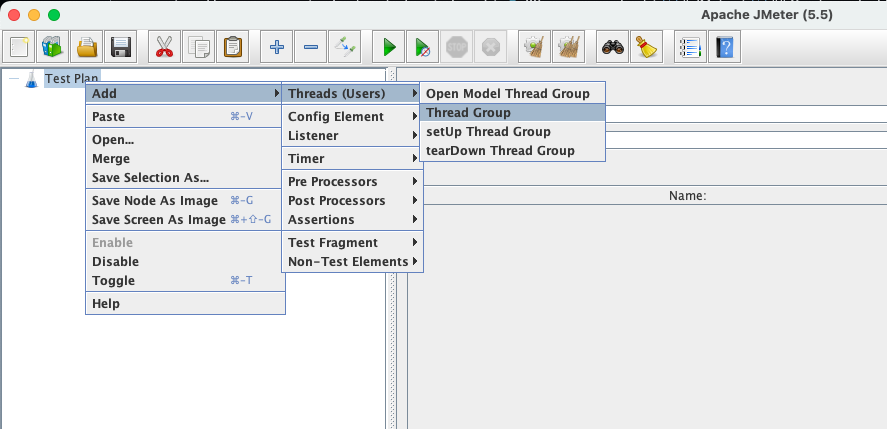
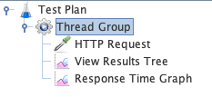
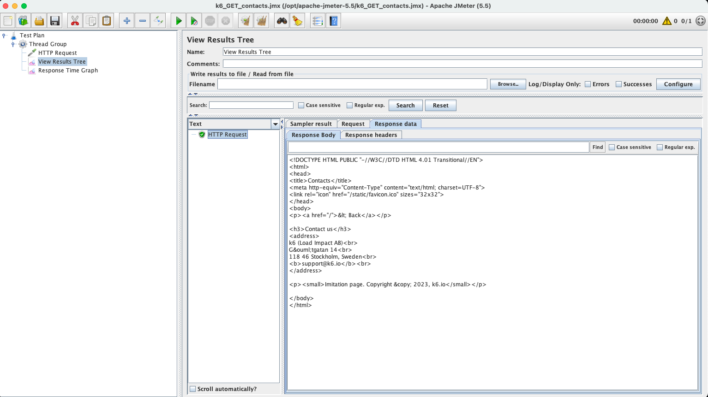
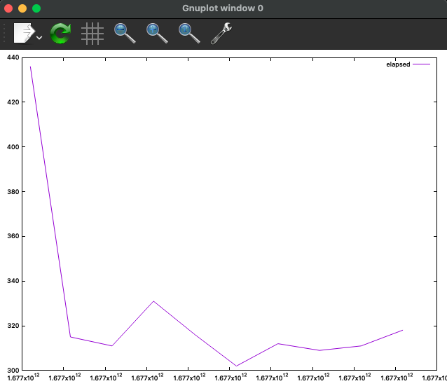

# JMeter

## Foreword

We've looked at some of the considerations around performance testing but
haven't really talked about _what_ is being tested, beyond calling it "the
system" or something similar.

For the sorts of websites we've been thinking about, there's the back-end and
the front-end to consider. With the back-end, we would be thinking about things
like HTTP request-response round trip times and how quickly the server is able
to serve up the requested resources which can be downloaded by browsers. With
the front-end, it's the user experience, but the focus is more on things like
how quickly the page renders and is typically not something related to things
like stress testing.

In this section, with a tool called JMeter, we'll be doing performance testing
to look at the performance of the back-end of a website.

## Load Testing Tool - JMeter

**Apache JMeter** is a tool which can be configured to run load tests and also
measures and reports back performance for services which include web
applications. It's this that you're going to get to do next!

We'll split the work into three phases - installation, creating a "test plan"
(N.B. not quite the sort of plan you've seen before but it's related!), then
running various tests and looking at the results.

JMeter has two modes - a GUI (graphical user interface) which will allow you to
build and configure a test plan, and a CLI (command line interface) which will
allow you to run the test plan you created.

## Installation

Download the `.zip` binary variant of Apache JMeter from
[Apache](https://jmeter.apache.org/download_jmeter.cgi), unzip the contents and
move the resulting folder, something like `apache-jmeter-5.5`, to `/opt/`. After
that, at the terminal `cd /opt/apache-jmeter-5.5` so you're ready to run JMeter.

We're also going to use `gnuplot` to draw some graphs later on. It can take a
while to install, so you should run this command now in a **new** terminal and
move on to "Creating a Test Plan" below, while the installation of `gnuplot`
runs in the background:

```
brew install gnuplot
```

## Creating a Test Plan

A "test plan" is JMeter terminology for a pre-defined set of tests, such as HTTP
requests to be sent and tables of results to be saved somewhere.

We're going to run some performance tests on a public website -
https://test.k6.io - which is designed for this sort of thing, but:

> Caution: don't go running performance tests against other sites without
> permission! You might end up doing a [Denial of Service (Dos)
> attack](https://en.wikipedia.org/wiki/Denial-of-service_attack), which is most
> likely illegal.

Browse to the site yourself for a moment and take a look around - _explore_ it,
if you will. You'll find a list of pages which you can visit in your browser.
Using Dev Tools, perhaps you'll be able to compare the response times for pages
like `Contacts` and `News` - is one obviously slower than the other, for you?

We're going to be using the public pages - the ones that don't require
authentication - as that's easier to set up and we don't need or want to add in
an authentication complication to our performance testing, today. Specifically,
we're going to be testing `GET /news.php`.

On the command line and from the installation directory from earlier (e.g.
`/opt/apache-jmeter-5.5`), start JMeter's GUI by running:

```
% ./bin/jmeter
```

Apache JMeter should load after a brief pause, showing you an empty test plan.

From the context menu of "Test Plan" in the mostly empty tree on the left-hand
side, choose `Add` -> `Threads (Users)` -> `Thread Group`:



A "Thread Group" is a sequence of actions - we're going to put our requests and
results collation into that thread group.

Next, from the context menu of "Thread Group", we'll add each of the following,
in the order shown below:

* `Add` -> `Sampler` -> `HTTP Request`
* `Add` -> `Listener` -> `View Results Tree`
* `Add` -> `Listener` -> `Response Time Graph`

You should end up with something that looks like this:



The latter two don't need configuring right now, but our "HTTP Request" does as
we need to tell it what to do! Click on it to open it, then change these
settings:

* Protocol (http): `https`
* Server name or IP: `test.k6.io`
* Path: `/news.php`

Nothing else needs to be changed here, just those three settings.

This sequence of actions (HTTP Request, View Results Tree, Response Time Graph)
we've added to our Thread Group can be configured e.g. to run just once as if
one user was accessing the page, or many times as if many users were accessing
the page (all at once or over a period of time). This configuration is done in
the Thread Group itself.  Click on it to open it... but for now, we're just
looking and won't make any changes:

* Number of Threads (users): how many users will we create - in our case, this
  is essentially how many `GET /news.php` requests will we make.
* Ramp-up period (seconds): over how much time will those users' requests be
  kicked-off - in our case, as there's only `1` user, this setting currently
  doesn't do anything. If it was set to `0` seconds, all threads/users would
  start at the same time. If it was set to anything higher, there would be a
  staggered starting of the threads/users.

> We're still setting things up and doing our checks at the moment, so we're
> going to keep using the GUI for a little while longer rather than the CLI
> where we'll eventually run our "proper" performance tests.

Let's try out our performance test! Click the first of the green arrows called
"Start" in the toolbar in JMeter. When prompted to save, do so - call it
`k6_GET_news.jmx`. Once done, it'll have run the performance test so click on
"View Results Tree" to see what happened. If it succeeded, there will be a green
"HTTP Request" listed which you can click on to open, then explore things like
the response and response body i.e.:



<details>
  <summary>Can you find out in JMeter how much time it took for this successful request to "load"? Click here if you've looked but can't find it.</summary>

If you select the request and look in its "Sampler result" tab, you can see a
"Load time" field - that's the amount of time it took to get a response back in
milliseconds.
</details>

### Exercise 1

Change the number of threads/users (and therefore the number of GET requests)
that will be sent from `1` to `10` and have them all run over a period of `10`s
in order to stagger their start times.

Find the "Clear All" button in JMeter's toolbar, then run your test again.

Once it has finished running, open the previously unused "Response Time Graph",
and:

* Change the "Interval (ms)" to `1`
* "Apply interval"
* Change the "Shape point" to `None`
* "Display Graph"

How does that match up with the individual "load times" for your 10 requests, as
seen in "View Results Tree"?

### Exercise 2

Repeat the process again, but this time with no staggered starting of the 10
users and threads. You'll need to work out what to change to achieve this -
there are some details higher up this page you should review, if you're not sure
what to do.

Do you see any different _performance_ when all the requests are made at the
same time, potentially causing more load on the server, than when they were sent
one-by-one and not interfering with each other?

<details>
  <summary>Click here once you've run this second exercise and have reviewed your findings.</summary>

At this point, you're unlikely to see much performance difference between
exercises 1 and 2 - 10 users _in parallel_ (i.e. starting at the same time)
isn't likely to load the server all that much. Unless you were lucky/unlucky(!)
and someone else was heavily loading https://test.k6.io/news.php at the same
time, the graphs will look pretty similar in terms of the average and
maximum/minimum load times.
</details>

## Modify your Test Plan

Before we run things at a much larger scale (a lot more than just 10 users!),
we'd like to parameterise some of the settings so that we can control them from
the command line. It would be tiresome to have to open the JMeter GUI and edit
the plan every time we want, let's say, a different number of users!

<!-- OMITTED -->

Click the "Thread Group" and change these two settings:

* Number of Threads (users): `${__P(threads,)}`
* Ramp-up period (seconds): `${__P(rampup,)}`

> Note: you may find you can't paste text into JMeter, so take care when typing
> those two values in, noting there are two "_" near the beginning of each of
> them.

Lastly, click the "Response Time Graph" and change this setting, so that we can
get some saved results we can analyse, once we've run from the command line:

* Filename: `${__P(csvdata,)}`

Save your plan again then close the GUI.

## Running your Test Plan

> We don't run the test plan in the GUI mode of JMeter because we wouldn't get
> optimal results - JMeter's GUI itself would be having an effect on the
> performance and, in the real world, you'd want to remove as many external
> factors affecting your results as possible.

Back on the command line, from where you previously started the JMeter GUI,
we'll run the JMeter CLI. We'll be using the parameters we defined for users,
ramp-up time and the CSV file to create, and we'll be telling it which test plan
to use - that's the `.jmx` file we saved.

Run the following command:

```
% ./bin/jmeter -n -t k6_GET_news.jmx -Jthreads=10 -Jrampup=10 -Jcsvdata=10users_10s.csv
```

As there's a 10s ramp-up time, this should take about 10s to run. Once it has
finished, run the following command and near the bottom of the output list of
files (ordered by date, most recent last) you should see a CSV file of your data
called `10users_10s.csv` - that's the name we specified in the JMeter CLI
command we ran:

```
% ls -lrt
[...]
-rw-r--r--    1 paulgilson  staff    1364 21 Feb 16:22 10users_10s.csv
-rw-r--r--    1 paulgilson  staff    8616 21 Feb 16:22 jmeter.log
```

We're going to use `gnuplot`, which we installed earlier, to plot the data in a
graph for us. The following command should do that for us and automatically open
the graph in a new window:

```
% gnuplot -e "set key autotitle columnheader; set datafile separator \",\"; plot '10users_10s.csv' with linespoints" -p
```

<details>
  <summary>You don't <i>need</i> to know what that command is doing, but if you <i>want</i> to know, click here!</summary>

> `set key autotitle columnheader` => file contains column headers rather than
> data on the first row
> 
> `set datafile separator ","` => file is CSV, with commas separating the content
> with no spaces after them
> 
> `plot '10users_10s.csv' with linespoints` => use this CSV file and draw lines
> between the connected data points
> 
> `-p` => persist the graph, rather than closing the window automatically after
> the command has run
</details>

Hopefully by this stage, you'll see a graph looking something like:



If you want to use some other application for reviewing CSV performance data,
you're very welcome to do so - we're using `gnuplot` here as it's sometimes
convenient to have a command line program you can quickly use (cf. cURL in an
earlier phase).

[Next Challenge](09_challenge.md)

<!-- BEGIN GENERATED SECTION DO NOT EDIT -->

---

**How was this resource?**  
[😫](https://airtable.com/shrUJ3t7KLMqVRFKR?prefill_Repository=makersacademy%2Fextending-testing&prefill_File=phase7%2F08_exercises.md&prefill_Sentiment=😫) [😕](https://airtable.com/shrUJ3t7KLMqVRFKR?prefill_Repository=makersacademy%2Fextending-testing&prefill_File=phase7%2F08_exercises.md&prefill_Sentiment=😕) [😐](https://airtable.com/shrUJ3t7KLMqVRFKR?prefill_Repository=makersacademy%2Fextending-testing&prefill_File=phase7%2F08_exercises.md&prefill_Sentiment=😐) [🙂](https://airtable.com/shrUJ3t7KLMqVRFKR?prefill_Repository=makersacademy%2Fextending-testing&prefill_File=phase7%2F08_exercises.md&prefill_Sentiment=🙂) [😀](https://airtable.com/shrUJ3t7KLMqVRFKR?prefill_Repository=makersacademy%2Fextending-testing&prefill_File=phase7%2F08_exercises.md&prefill_Sentiment=😀)  
Click an emoji to tell us.

<!-- END GENERATED SECTION DO NOT EDIT -->
