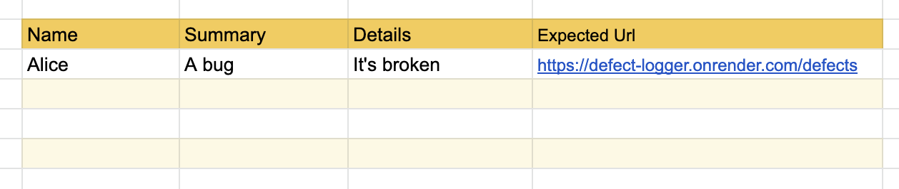

# Introducing Data Driven Testing

Let's start by imagining a scenario in which data driven testing (whatever
_that_ is) could be the solution...

## Defect Logger

The company you work for has its own tool for reporting and tracking defects -
it's imaginatively called _Defect Logger_. You've been asked to create a small
regression testing suite and have been given this guidance...

- Defects are logged using [this form](https://defect-logger.onrender.com/)
- Name, Summary and Details are all mandatory fields
- Name must be no longer than 30 characters
- Summary must be no longer than 50 characters
- Details must be between 100 and 300 characters

So you create a test suite that reflects these boundaries...

- A test with a 30 and 31 character name
- A test with a 50 and 51 character summary
- A test with a 99, 100, 300 and 301 character details section

The last set of tests, in particular, are problematic because they're messy and,
worse, it's easy to get the number of characters wrong.

Testing with 99 characters...

```java
detailsField.fill(
    "I found a buggy bugg" +
    "I found a buggy bugg" +
    "I found a buggy bugg" +
    "I found a buggy bugg" +
    "I found a buggy bug"
);
```

Testing with 100 characters...

```java
detailsField.fill(
    "I found a buggy bugg" +
    "I found a buggy bugg" +
    "I found a buggy bugg" +
    "I found a buggy bugg" +
    "I found a buggy bugg"
);
```

Testing with 300 characters

```java
detailsField.fill(
    "I found a buggy bugg" +
    "I found a buggy bugg" +
    "I found a buggy bugg" +
    "I found a buggy bugg" +
    "I found a buggy bugg" +
    "I found a buggy bugg" +
    "I found a buggy bugg" +
    "I found a buggy bugg" +
    "I found a buggy bugg" +
    "I found a buggy bugg" +
    "I found a buggy bugg" +
    "I found a buggy bugg" +
    "I found a buggy bugg" +
    "I found a buggy bugg" +
    "I found a buggy bugg"
);
```

Testing with 301 characters...

```java
detailsField.fill(
    "I found a buggy bugg" +
    "I found a buggy bugg" +
    "I found a buggy bugg" +
    "I found a buggy bugg" +
    "I found a buggy bugg" +
    "I found a buggy bugg" +
    "I found a buggy bugg" +
    "I found a buggy bugg" +
    "I found a buggy bugg" +
    "I found a buggy bugg" +
    "I found a buggy bugg" +
    "I found a buggy bugg" +
    "I found a buggy bugg" +
    "I found a buggy bugg" +
    "I found a buggy buggy"
);
```

Also, since Defect Logger is new, the requirements are likely to change as
feedback comes in.

Wouldn't it be great if you could store these inputs somewhere separate from
your test suite? Then your tests would be neater and, maybe, user researchers or
business analysts could update the test cases.

If you used a spreadsheet, you could also include a `character count` column, to
reduce the chance of someone making a mistake there.

## Data Driven Testing Saves the Day

You'll be pleased to know that all of the above is possible! The method of
separating test cases from the test codebase is called Data Driven Testing - the
_data_ being your spreadsheet of test cases.

### How it Works - The Big Picture

So, how do you achieve this?

First, you'd put your test inputs in a file. A spreadsheet is a good option
because most of your colleagues will be familiar with them. For Defect Logger,
something like this would be useful.



> This test case is for an invalid submission so we'd expect the application to
> re-render the form, following the request to `POST "/defects"`, and for the
> URL to be `https://defect-logger.onrender.com/defects`. Try it out!

After you've got your spreadsheet ready, you'd then write a test that iterates
through all the rows and uses the relevant values for test inputs and
assertions.

In the next section, we'll dive into the detail of working with spreadsheets.
Then we'll look at how to write some tests that iterate through multiple input
values. Finally, you'll be challenged to combine both approaches and refactor
some existing tests.


[Next Challenge](02_working_with_spreadsheets.md)

<!-- BEGIN GENERATED SECTION DO NOT EDIT -->

---

**How was this resource?**  
[😫](https://airtable.com/shrUJ3t7KLMqVRFKR?prefill_Repository=makersacademy%2Fextending-testing&prefill_File=phase8%2F01_introduction.md&prefill_Sentiment=😫) [😕](https://airtable.com/shrUJ3t7KLMqVRFKR?prefill_Repository=makersacademy%2Fextending-testing&prefill_File=phase8%2F01_introduction.md&prefill_Sentiment=😕) [😐](https://airtable.com/shrUJ3t7KLMqVRFKR?prefill_Repository=makersacademy%2Fextending-testing&prefill_File=phase8%2F01_introduction.md&prefill_Sentiment=😐) [🙂](https://airtable.com/shrUJ3t7KLMqVRFKR?prefill_Repository=makersacademy%2Fextending-testing&prefill_File=phase8%2F01_introduction.md&prefill_Sentiment=🙂) [😀](https://airtable.com/shrUJ3t7KLMqVRFKR?prefill_Repository=makersacademy%2Fextending-testing&prefill_File=phase8%2F01_introduction.md&prefill_Sentiment=😀)  
Click an emoji to tell us.

<!-- END GENERATED SECTION DO NOT EDIT -->
